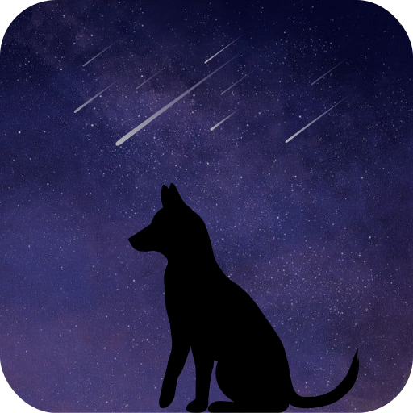

# <h1 align="center"><br>Laika</h1>

<p align="center">
    <a href="https://kotlinlang.org/"></a>
    <a href="https://kotlinlang.org/"></a>
    <a href="./"></a>
    <a href="./LICENSE"></a>
</p>

<p align="center">
    !! Leika is still in early development stage, any structure or usage can be changed !!
</p>

<p align="center">
    `Laika 🐕` is a <a href="https://github.com/remote-kakao">Remote-Kakao</a> compatible Kotlin-coroutines based client (WIP)
</p>

<p align="center">
    ✔ Any PRs are welcome!
</p>


### Usage

+ Create `Laika` instance
```kotlin
val laika = Laika {
    hostname = "192.168.0.11" // Replace with your server's IP
    port = 2323               // Server port
    maxRetryAttempt = 3
}
```

+ Set server event listener and create reply message
```kotlin
laika.on<MessageReceiveEvent> {
    if (message.content == "!hello") {
        message.room.send("Hello, ${message.sender.name} on ${message.room.name}!")
    }
}
```

+ Start client
```kotlin
laika.start()
```

#### Full example code
```kotlin
suspend fun main() {
    val laika = Laika {
        hostname = "192.168.0.11" // Replace with your server's IP
        port = 2323               // Server port
        maxRetryAttempt = 3
    }

    laika.on<MessageReceiveEvent> {
        if (message.content == "!hello") {
            message.room.send("Hello, ${message.sender.name} on ${message.room.name}!")
        }
    }

    laika.start()
}
```

## License
```
Designed and developed by 2022 mooner1022 (Minki Moon)

This program is free software: you can redistribute it and/or modify
it under the terms of the GNU General Public License as published by
the Free Software Foundation, either version 3 of the License, or
any later version.

This program is distributed in the hope that it will be useful,
but WITHOUT ANY WARRANTY; without even the implied warranty of
MERCHANTABILITY or FITNESS FOR A PARTICULAR PURPOSE.  See the
GNU General Public License for more details.

You should have received a copy of the GNU General Public License
along with this program.  If not, see <http://www.gnu.org/licenses/>.
```
